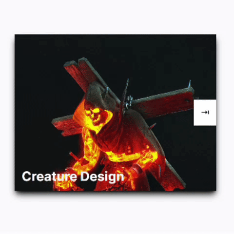

# craft-hub
😵Assesment 1 of "Pemrograman-1"

## Home


Ini adalah sebuah hipotesis kursus online website untuk para kreatif yang ingin berkembang dan mempelajari hal/teknik baru untuk mengasah dan mempertajam skillnya

## Membuat carousel sederhana
```html
<div class="relative justify-self-stretch" data-carousel>
  <button class="absolute right-0 z-10 p-4 text-xl -translate-y-1/2 bg-white top-1/2 " data-carousel-button>&#8677</button>
  <ul data-slides class="text-white">
    <li 
      class="w-full h-full p-4 text-3xl font-bold bg-top bg-cover shadow-lg slide place shadow-black" 
      style="background-image: url(https://cdna.artstation.com/p/assets/images/images/069/184/658/large/maksim-croprender2.jpg?1699527795);" 
      data-active
    ><div class="absolute bottom-4">Creature Design</div></li>
    <li 
      class="w-full h-full p-4 text-3xl font-bold bg-cover shadow-lg slide place shadow-black"
      style="background-image: url(https://cdna.artstation.com/p/assets/images/images/069/180/908/large/joshua-jay-cherisch-09-01.jpg?1699520474);"
    ><div class="absolute bottom-4">Dynamic Concept Art</div></li>
    <li 
      class="w-full h-full p-4 text-3xl font-bold bg-cover shadow-lg slide place shadow-black"
      style="background-image: url(https://cdnb.artstation.com/p/assets/images/images/003/792/519/large/jaime-jasso-stormwind-01s.jpg?1477520955);"
    ><div class="absolute bottom-4">3D Matte Painting</div></li>
  </ul>
</div>
```
## Hasil


Disini saya menambahkan beberapa ***data-attribute*** sebagai ekstra informasi agar nanti bisa dipanggil di ***Javascript***
## Implementasi mengganti slide dengan click event
```js
const btn = document.querySelector("[data-carousel-button]");
btn.addEventListener("click", () => {
  const slides = btn.closest("[data-carousel]").querySelector("[data-slides]");
  const activeSlide = slides.querySelector("[data-active]");
  let index = ([...slides.children].indexOf(activeSlide) + 1) % slides.children.length;

  slides.children[index].dataset.active = true;
  delete activeSlide.dataset.active;
});
```
